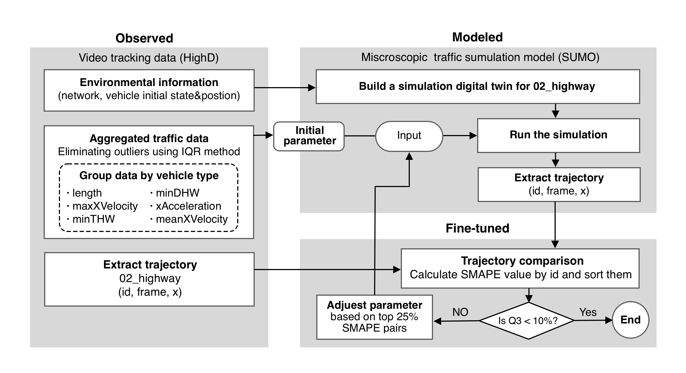
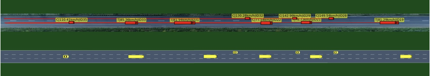

# Calibrating SUMO EIDM Model using HighD Dataset
🚙🛣️🚦📊🔧📈🛠️

 

**Official calibration process** in the paper *[Learning from Trajectories: How Heterogeneous CACC Platoons Affect the Traffic Flow in Highway Merging Area]()(not yet publish)* 

**Features**:

* Instead of fixed parameters for all vehicles within its type, each vehicle has different parameters, and its cluster follows the statistical distribution of parameters for that type of vehicle.
* Build a digital twin testing scenario for the HighD dataset, fully simulate interactions between multiple vehicles, and improve calibration credibility.

An overview of the model architecture is depicted below.



**digital twin for HighD 02_highway:** 



**Final calibration result:**


## Getting Started

### Prerequisites

* **SUMO**

  You can now install sumo with pip3 in linux

  ```shell
  pip3 install eclipse-sumo==1.14.1
  pip3 install sumolib==1.14.1
  pip3 install traci==1.14.1
  ```

* **Python3 extensions**

  ```shell
  pip3 install pandas numpy matplotlib
  ```

  

* **HighD dataset**

	You can download HighD dataset in its [offical website](https://www.highd-dataset.com/%23download), data use requires application in davance.
	Once the date is ready, put them into `./data` folder.

* **Clone this repo**

  ```shell
  git clone --depth 1 https://github.com/Gaochengzhi/SUMO-calibration
  ```


### Running the demo

❗️Graphics is set to false by default to save computation resources, you can set it in `main.py` by setting `GUI=True`

* Running  main.py  could generate the simulated trajectory corresponding to 02_highways scenari.

```shell
python3 main.py
```

* After simulation is excuted, simulated trajectory data is placed in `./data/simulated/` folder. you can run the `compare.py` to compare them

```shell
python3 compare.py
```

you can change line:112 to select showing range of sorted most similar pairs

```python3
nth = len(s)
nth_most_similar = [int(nth)-22, int(nth)-1] # least 21 similar
```
Inital data guest is by calculating the statistical description of the whole HighD data set, you can do it by running the `statistic.py`, a csv table named `result.csv` will be generated 

## Customization
❗️**The shell script used in this section is not windows compatible, you can use WSL or write your own implementation instead**

### Adjuest car-following model parameters
Model parameters are in the `cfg/veh_config` file, **after you change it, you must activated it by running `geneType.sh` in the `cfg` folder**

### Change net work settings

* Another HighD scenario:
  change the trajectory tracking model in `main.py`
  ```python3
  def trajectory_tracking():
    tracks_meta_path = "../data/02_tracksMeta.csv"
    tracks_path = "../data/02_tracks.csv"

    tracks_meta = {}
    with open(tracks_meta_path, newline='') as csvfile:
        reader = csv.DictReader(csvfile)
        for row in reader:
            if int(row['drivingDirection']) == 1:
                tracks_meta[int(row['id'])] = {
                    'initialFrame': int(row['initialFrame']),
                    'class': row['class']
                }
  ```

## Further develop
* This project is highly integrated with the HighD dataset, but you can adapt it to other datasets formats.
* The process of adjusting parameters is manual, but it can be easily automated for parameter tuning. 
  
**Welcome to contribute code**

🚗🚕🚙🚚🚛🚜🚛🚚🚙🚕🚗

